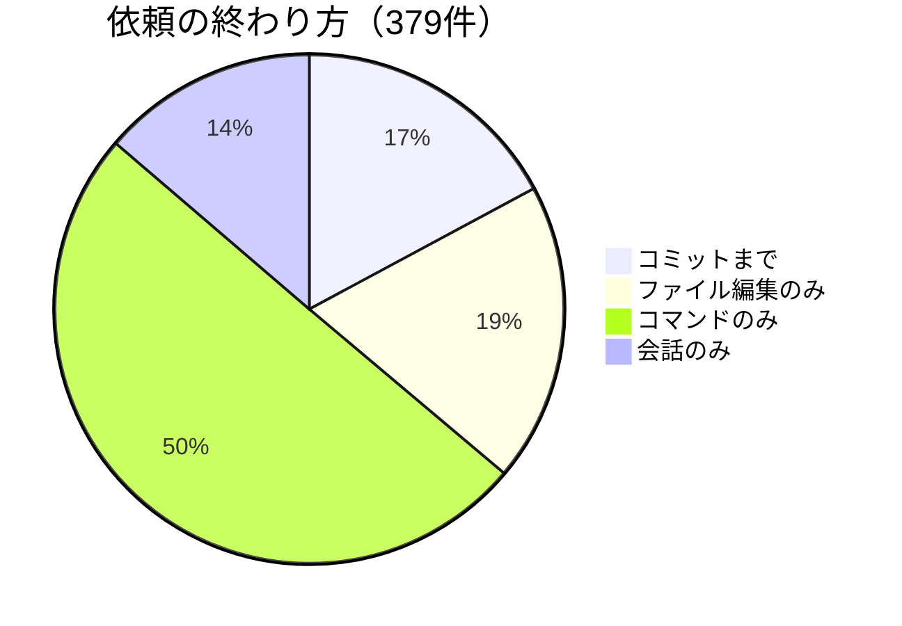

Claude Code の成果は、コードやコミットで語られることが多い。何を書いたか、何をコミットしたか。成果を測るなら、そこを見れば足りる——そう思われがちです。

自分の依頼379件を数えてみると、**コミットで終わったのは17%**でした。半分は「コマンドを動かしただけ」で終わっています。コミットだけで数えると、見えない仕事のほうが多かったのです。

対象は9月3日〜10月1日の自分の記録です。自分の発言から次の発言までを1依頼として、終わり方を分けました。

| 依頼の終わり方 | 件数 | 割合 |
|---|---:|---:|
| コミットまで行った | 65 | 17% |
| ファイルを編集した（コミットなし） | 72 | 19% |
| コマンドを動かしただけ | 190 | 50% |
| 会話だけ | 52 | 14% |



## コミット以外に何があるか

「コマンドを動かしただけ」が半数です。ラベルだけ見ると、何も残していない依頼に読めます。依頼文を見ると、中身は違います（依頼文は短く切っています）。

- 「次、平地に今さっきの巨大ゴブリンのサイズ2倍のドラゴン生成できる？」→ ゲームMODのモデルとパラメータを書き換えて再ビルド。**ちゃんと物を作っている**。ただ、ファイルの書き換えは編集ツールではなくシェルのコマンドで行っていて、その会話の中でコミットもしていない。だから記録上は「コマンドを動かしただけ」になる。
- 「Linuxの更新は今後もしないほうが良いのかどうか調査して」→ OSのバージョン、保留中の更新、更新履歴を確認。**調べて判断材料を出す**仕事。
- 「以後、日本語で返答してください」→ 設定のメモを確認して保存。**設定**の仕事。

この例には、次のような仕事が含まれます（ここは件数を数えた分類ではなく、例を読んだうえでの私の見立てです）。

- **git の外で作っている**：ノート、デスクトップの設定、メモ。作ってはいるが、コミットという形が存在しない。
- **シェルで直している**：編集ツールではなく、コマンドでファイルを書き換えている。記録上は「コマンドを動かしただけ」に見える。
- **調べる・確かめる・動かす**：調査、テスト、比較、サービスの起動や確認。成果物は「答え」や「確認できた」という事実。

コミットという形を持たない仕事が、ここに入っています。

## 自分で測る

同じ数え方を、手元のセッション記録で試せます。読み取るだけで、外には何も送りません。

数え方の決まりは3つです。

- 1依頼 ＝ 自分の発言から次の発言まで（スラッシュコマンドや通知は除く）
- コミット ＝ `git commit` を含むコマンドがエラーなく終わった
- 編集 ＝ Edit / Write などの編集ツールを使った

```python:cc_outcomes.py
#!/usr/bin/env python3
"""Claude Code への依頼が「何で終わったか」を数える（読み取りのみ・外部送信なし）。

~/.claude/projects/ のセッション記録（jsonl）を読み、あなたの1回の発言から次の発言までを「1依頼」として、
コミット / ファイル編集のみ / コマンドのみ / 会話のみ に分けます。
"""
import json, re, sys
from collections import Counter
from pathlib import Path

ROOT = Path.home() / ".claude/projects"
UNTIL = sys.argv[1] if len(sys.argv) > 1 else "9999"  # 例: 2026-10-01T15:00:00Z（この時刻より前の依頼だけ数える）
COMMIT = re.compile(r"\bgit\b[^\n|;&]*\bcommit\b")  # git commit を実行したコマンド（-q で出力が無くても拾う）
EDIT_TOOLS = {"Edit", "Write", "MultiEdit", "NotebookEdit"}


def human_text(msg):
    c = msg.get("content")
    if isinstance(c, str):
        return c
    if isinstance(c, list) and all(isinstance(x, dict) and x.get("type") == "text" for x in c):
        return "".join(x["text"] for x in c)
    return None  # ツール結果など、人の発言ではないもの


counts = Counter()
for f in ROOT.glob("*/*.jsonl"):
    task = None
    for line in f.read_text(encoding="utf-8", errors="ignore").splitlines():
        try:
            r = json.loads(line)
        except ValueError:
            continue
        m = r.get("message") or {}
        if r.get("type") == "user" and not r.get("isMeta"):
            t = human_text(m)
            if t and t.strip() and not t.lstrip().startswith(("<command-", "<local-command", "<task-notification")):
                if (r.get("timestamp") or "") >= UNTIL:
                    break  # 期間外（セッションは時刻順なので、ここから先は数えない）
                if task:
                    counts[task["kind"]()] += 1
                task = {"commit": False, "edit": False, "bash": 0, "commit_ids": set()}
                task["kind"] = lambda t=task: ("commit" if t["commit"] else "edit_only" if t["edit"]
                                              else "commands_only" if t["bash"] else "talk_only")
                continue
            for x in m.get("content") or []:
                if task and isinstance(x, dict) and x.get("type") == "tool_result":
                    if x.get("tool_use_id") in task["commit_ids"] and not x.get("is_error"):
                        task["commit"] = True  # コミットのコマンドがエラーなく終わった
        elif r.get("type") == "assistant" and task:
            for x in m.get("content") or []:
                if isinstance(x, dict) and x.get("type") == "tool_use":
                    task["bash"] += x.get("name") == "Bash"
                    if x.get("name") == "Bash" and COMMIT.search((x.get("input") or {}).get("command", "")):
                        task["commit_ids"].add(x.get("id"))
                    task["edit"] |= x.get("name") in EDIT_TOOLS
    if task:
        counts[task["kind"]()] += 1

total = sum(counts.values())
print(f"依頼 {total} 件")
for k, name in (("commit", "コミットまで"), ("edit_only", "ファイル編集のみ（コミットなし）"),
                ("commands_only", "コマンドを動かしただけ"), ("talk_only", "会話だけ")):
    print(f"  {name}: {counts[k]} 件（{counts[k] / total:.0%}）" if total else "")
```

```bash
python3 cc_outcomes.py                        # 全期間
python3 cc_outcomes.py 2026-10-01T15:00:00Z   # この時刻より前だけ（この記事の集計）
```

この実行例は、今回の集計と同じ終了時刻を指定しています。スクリプトは終了時刻より前の依頼を数えます。開始日を指定する引数はないため、手元に9月3日より前の記録があれば、それも含まれます。この記事の17%と並べるときは、その点だけ見てください。

## この数字の限界

- 1人・約1か月分です。使い方が違えば、割合はまったく変わるはずです。
- 「シェルで直した」編集は「コマンドだけ」に入ります。編集を少なめに数えています。
- 画像を貼った発言は「人の発言」として数えていません（前の依頼に含まれます）。
- 「コミットした＝良い仕事」でも「コミットしなかった＝無駄」でもありません。測っているのは**終わり方**だけです。

## 数えて分かったこと

コミットは、Claude Code の仕事の一部しか映していません。調べた答えや確認できた事実は、コミットにならないので、記録しておかないと残りません。私の環境では、Claude Code の作業ごとに「何をして、何が分かったか」を要約して残す仕組みを使っています。

あなたの手元では、何%がコミットで終わっていますか。
